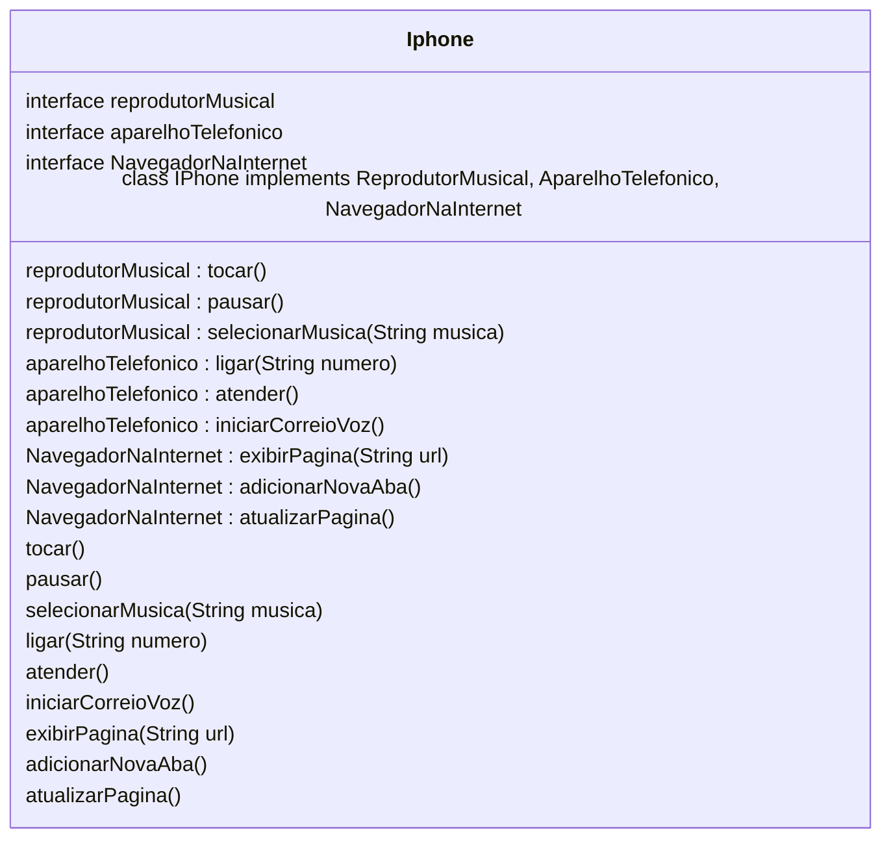

```mermaid
classDiagram
class Iphone{
    
    interface reprodutorMusical
    reprodutorMusical : tocar() 
    reprodutorMusical : pausar()
    reprodutorMusical : selecionarMusica(String musica)


    interface aparelhoTelefonico 
    aparelhoTelefonico : ligar(String numero)
    aparelhoTelefonico : atender()
    aparelhoTelefonico : iniciarCorreioVoz()


    interface NavegadorNaInternet 
    NavegadorNaInternet : exibirPagina(String url)
    NavegadorNaInternet : adicionarNovaAba()
    NavegadorNaInternet : atualizarPagina()


class IPhone implements ReprodutorMusical, AparelhoTelefonico, NavegadorNaInternet 
    tocar()
    pausar()
    selecionarMusica(String musica)
    ligar(String numero)
    atender()
    iniciarCorreioVoz()
    exibirPagina(String url)
    adicionarNovaAba()
    atualizarPagina()

}


```